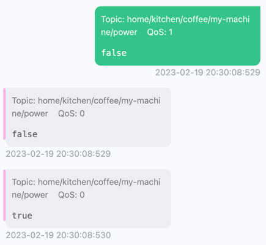

# home-operator aka "kube kaffee"


<p style="text-align: center;">A good coffee is what we desire.</p>

## Description

This operator watches a MQTT topic and uses this to communicate with smart home appliances. The desired state of the appliance
is stored inside kubernetes. Kubetl can then be used to turn the coffee machine on or off.

### Example CRD
```yaml
apiVersion: appliances.home.sijoma.dev/v1alpha1
kind: CoffeeMachine
metadata:
  name: my-machine
  namespace: default
spec:
  power: true
```

## Demo 

### Setup
Running the following command will build the operator and set up a kind cluster with a mosquitto & home operator deployment.

```bash
make setup-test-env
```

After running, you should see the following logs in mosquitto:

```logs
chown: /mosquitto/config/mosquitto.conf: Read-only file system
1676832927: mosquitto version 2.0.15 starting
1676832927: Config loaded from /mosquitto/config/mosquitto.conf.
1676832927: Opening ipv4 listen socket on port 1883.
1676832927: mosquitto version 2.0.15 running
1676832928: New connection from 10.244.0.6:36050 on port 1883.
1676832928: New client connected from 10.244.0.6:36050 as home-operator (p2, c1, k30).
```                   

The operator in the namespace `home-operator-system`, should also log `mqtt connected`. 

The following sample will also be applied to the cluster. Hint: only the default namespace is so far supported.

```yaml
apiVersion: appliances.home.sijoma.dev/v1alpha1
kind: CoffeeMachine
metadata:
  name: my-machine
  namespace: default
spec:
  power: true
```

### Testing it out

First describe the coffeemachine. Can you figure out when it was last turned on or off?
```bash
kubectl describe coffeemachines my-machine -n default
```

Now edit the CRD, and turn the field `power` to `false`. Describe it again.


### Watching the MQTT topic

You can also take a look at the MQTT message by port-forwarding the service. 
Then you need to subscribe to the topic `home/kitchen/coffee/+/power`. This can be 
done for example with a tool like MQTTX.
```bash
kubectl port-forward -n mqtt svc/mosquitto 1883
```


<p style="text-align: center;">We tried to override the desired state by sending a manual mqtt message. The operator acted swiftly and turned the coffee machine back on (last message).</p>


## Getting Started
You’ll need a Kubernetes cluster to run against. You can use [KIND](https://sigs.k8s.io/kind) to get a local cluster for testing, or run against a remote cluster.
**Note:** Your controller will automatically use the current context in your kubeconfig file (i.e. whatever cluster `kubectl cluster-info` shows).

### Running on the cluster
1. Install Instances of Custom Resources:

```sh
kubectl apply -f config/samples/
```

2. Build and push your image to the location specified by `IMG`:

```sh
make docker-build docker-push IMG=<some-registry>/home-operator:tag
```

3. Deploy the controller to the cluster with the image specified by `IMG`:

```sh
make deploy IMG=<some-registry>/home-operator:tag
```

### Uninstall CRDs
To delete the CRDs from the cluster:

```sh
make uninstall
```

### Undeploy controller
UnDeploy the controller from the cluster:

```sh
make undeploy
```

## Contributing
// TODO(user): Add detailed information on how you would like others to contribute to this project

### How it works
This project aims to follow the Kubernetes [Operator pattern](https://kubernetes.io/docs/concepts/extend-kubernetes/operator/).

It uses [Controllers](https://kubernetes.io/docs/concepts/architecture/controller/),
which provide a reconcile function responsible for synchronizing resources until the desired state is reached on the cluster.

### Test It Out
1. Install the CRDs into the cluster:

```sh
make install
```

2. Run your controller (this will run in the foreground, so switch to a new terminal if you want to leave it running):

```sh
make run
```

**NOTE:** You can also run this in one step by running: `make install run`

### Modifying the API definitions
If you are editing the API definitions, generate the manifests such as CRs or CRDs using:

```sh
make manifests
```

**NOTE:** Run `make --help` for more information on all potential `make` targets

More information can be found via the [Kubebuilder Documentation](https://book.kubebuilder.io/introduction.html)

## License

Copyright 2023.

Licensed under the Apache License, Version 2.0 (the "License");
you may not use this file except in compliance with the License.
You may obtain a copy of the License at

    http://www.apache.org/licenses/LICENSE-2.0

Unless required by applicable law or agreed to in writing, software
distributed under the License is distributed on an "AS IS" BASIS,
WITHOUT WARRANTIES OR CONDITIONS OF ANY KIND, either express or implied.
See the License for the specific language governing permissions and
limitations under the License.
